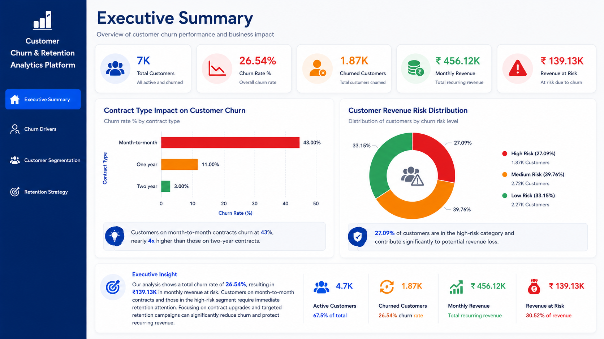
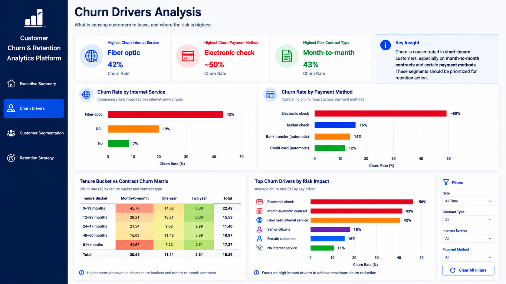
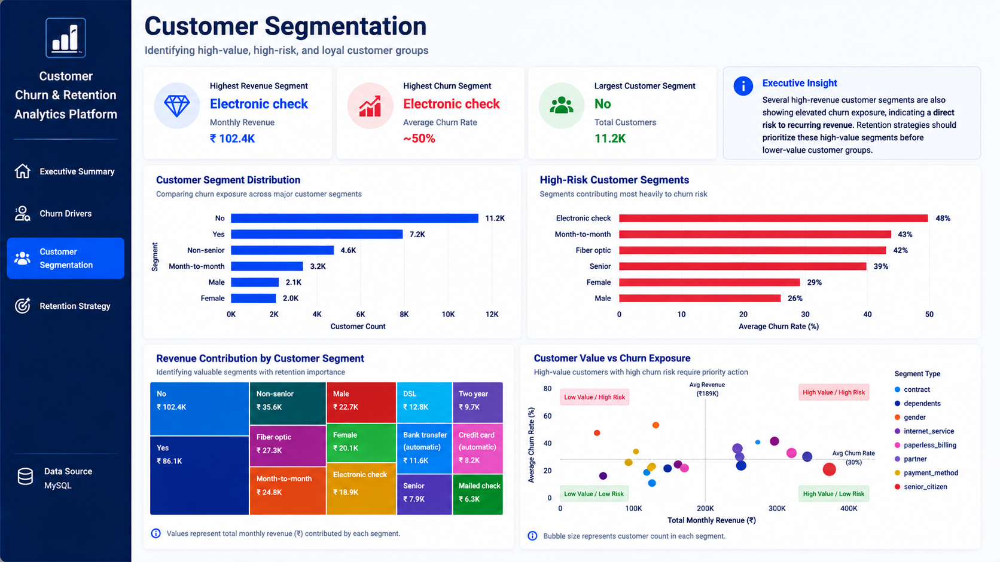
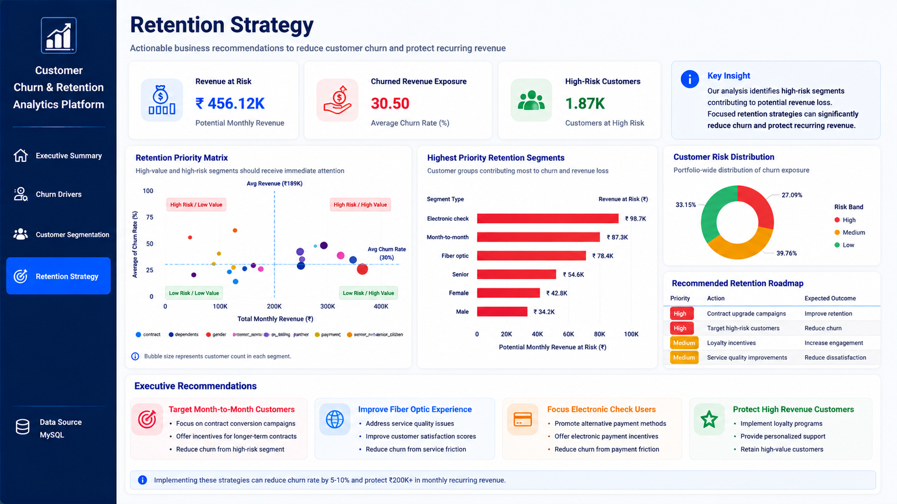

# Customer Churn & Retention Analytics Platform

An end-to-end analytics engineering project that transforms raw telecom customer data into executive-level churn insights using **Python, SQL, MySQL, and Power BI**.

This project demonstrates the complete analytics lifecycle:

- Data ingestion & cleaning
- Data quality validation
- SQL-based analytics
- KPI generation
- Customer segmentation
- Churn risk modeling
- Retention strategy recommendations
- Dashboard-ready exports for Power BI

---

# Project Objective

Customer churn is one of the biggest revenue risks for subscription businesses.

This project helps answer:

- Why are customers leaving?
- Which segments are most likely to churn?
- What services increase churn risk?
- Which customers should be prioritized for retention?

The goal is to convert raw customer-level data into actionable business intelligence.

---

# Tech Stack

| Layer | Tools |
|--|--|
| Programming | Python |
| Database | MySQL |
| Analytics | SQL |
| Visualization | Power BI |
| Data Processing | Pandas, NumPy |
| Environment | dotenv |
| Reporting | Excel |

---

# Project Architecture

```text
Raw Data → ETL Pipeline → Data Cleaning → Data Validation
→ MySQL Warehouse → SQL Analytics → Power BI Exports
→ Dashboarding → Business Insights
```

---

# Dashboard Preview

## 1. Executive Summary Dashboard



Key insights:

- Total customer base
- Overall churn rate
- Revenue at risk
- Monthly revenue trends
- Contract-type churn comparison

---

## 2. Churn Drivers Analysis



Focus areas:

- Internet service churn
- Payment method risk
- Contract impact
- Service-level churn analysis

---

## 3. Customer Segmentation Dashboard



Business segmentation:

- Customer lifetime value
- Tenure groups
- Revenue segments
- High-risk customer categories

---

## 4. Retention Strategy Dashboard



Actionable insights:

- Priority retention segments
- Revenue recovery opportunities
- Targeted retention recommendations
- High churn-risk customer groups

---

# Repository Structure

```text
Customer-Churn-Retention-Analytics/
│
├── data/
│   ├── raw/
│   ├── cleaned/
│   └── staging/
│
├── docs/
│   ├── 01_business_questions.md
│   ├── 02_data_sources.md
│   ├── 03_metric_definitions.md
│   ├── 04_data_dictionary.md
│   ├── 05_data_quality_log.md
│   ├── 06_logical_model.md
│   ├── 07_insights_and_recommendations.md
│   ├── 08_limitations_and_next_steps.md
│   └── 09_mysql_setup.md
│
├── python/
│   ├── config/
│   ├── etl/
│   ├── analysis/
│   ├── scripts/
│   └── utils/
│
├── sql/
│   ├── 01_ddl/
│   ├── 02_staging/
│   ├── 03_analytics/
│   ├── 04_power_bi_views/
│   └── mysql/
│
├── outputs/
│   ├── charts/
│   └── dashboard_screenshots/
│
├── powerbi/
│   ├── exports/
│   └── DATA_MODEL.md
│
├── requirements.txt
├── PROJECT_PLAN.md
└── README.md
```

---

# Quick Start

## Clone repository

```bash

cd customer-churn-retention-analytics
```

---

## Create virtual environment

```bash
python -m venv .venv
source .venv/bin/activate
```

Windows:

```bash
.venv\Scripts\activate
```

---

## Install dependencies

```bash
pip install -r requirements.txt
```

---

## Configure environment

Create:

```bash
.env
```

Using:

```bash
.env.example
```

---

## Run ETL pipeline

```bash
python python/etl/01_ingest_raw.py
python python/etl/02_clean_and_validate.py
python python/etl/03_run_quality_checks.py
python python/etl/04_load_to_mysql.py
```

---

## Run analytics

```bash
python python/analysis/01_churn_eda.py
python python/analysis/02_generate_charts.py
python python/analysis/03_export_for_powerbi.py
python python/analysis/04_build_excel_summary.py
```

---

# Key Business Insights

- Month-to-month contracts show highest churn
- Fiber optic users have elevated churn risk
- Electronic check customers churn the most
- Short-tenure customers are highly vulnerable
- High-value long-tenure customers require proactive retention

---

# Future Improvements

- ML churn prediction model
- Automated retention recommendation engine
- Real-time dashboard refresh
- Customer lifetime value forecasting

---

# Author

**Nitu Kumari**  
Data Analyst | Backend Engineer 

---

